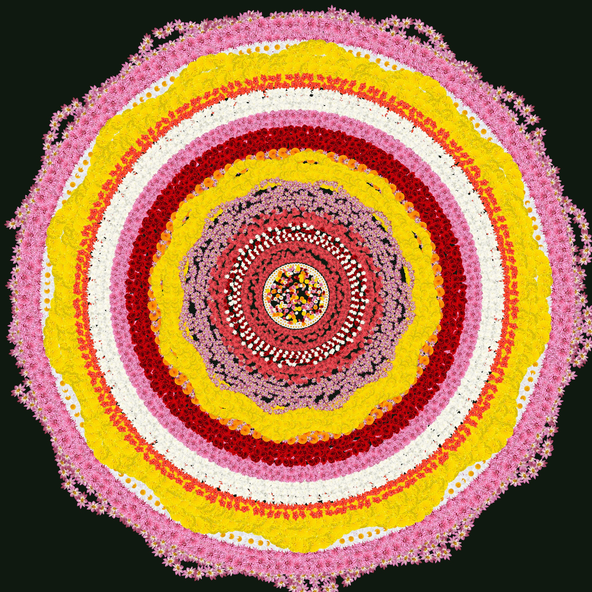
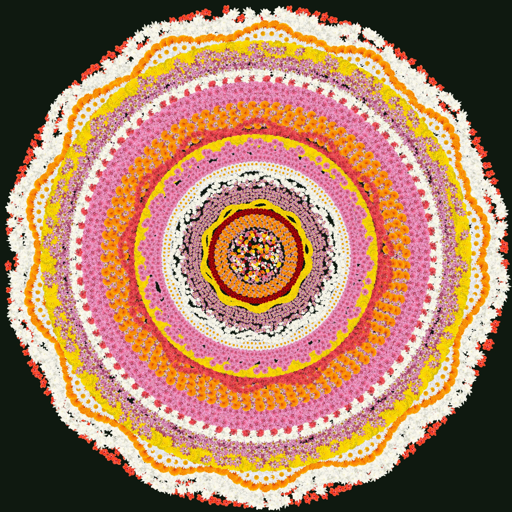

# 🌸 Edwin Joseph's Pookalam 2025 🌸

---

## 👨‍💻 About Me
- **Name:** [Edwin Joseph](https://www.instagram.com/_edw.inx?igsh=dWNsZGY0MGwyN3o=)
- **Institution:** [MBCCET Peermade](https://maps.app.goo.gl/16h5RnQLXWuDoLqc6)
- **GitHub:** [@edwinjosephshiju](https://github.com/edwinjosephshiju)
- **Programming Language Used:** [Python](https://www.python.org/)

---

## 🎨 My Pookalam

### Description

*A Digital Onam Pookalam: Tradition Meets Generative Art**
This Python script generates a vibrant and intricate digital Pookalam, a traditional floral carpet central to the Onam celebrations here in Kerala. The design captures the essence of this beautiful art form, blending the structured symmetry of a traditional Pookalam with the infinite variability of generative art.

---

**The Design Philosophy**

The final image is a high-resolution, radially symmetric floral masterpiece. It is built from the outside in, with dozens of concentric rings creating a mesmerizing sense of depth and complexity. The colours are drawn from a palette of flowers deeply familiar to the Onam festival—the bright oranges and yellows of marigolds, the deep red of the hibiscus, and the pure white of jasmine, all set against a white/transparent background.

The design's key feature is its transition in texture. The outer rings are orderly, with flowers arranged in subtle, wave-like patterns. As the rings move closer to the center, the flowers become slightly larger and overlap, creating a softer, fuller appearance. The design culminates in a densely packed, vibrant core where all the flowers are scattered in a random yet harmonious mix, ensuring no gaps and creating a lush focal point.

---

### Preview



---

### Features
- The code functions as a generative artist, following a set of rules and parameters to "build" the Pookalam from scratch.
- **Controlled Randomness:** The script intelligently selects a random sequence of flower types for the rings, ensuring each generated Pookalam is unique in its colour combination and flow.
- **Pattern Engines:** For each ring, a simple mathematical pattern (like a wave or zigzag) is applied to the flower placements. This introduces an organic, non-rigid order to the design, preventing it from     looking too robotic.
- **Density and Overlap:** By adjusting parameters like layers_per_ring and spacing_factor, the code controls how tightly the flowers are packed. The logic is specifically modified to increase the size of the flowers in the innermost rings to create a deliberate, soft overlap.

---

## 🚀 How to Run

### Prerequisites
```bash
pip install Pillow
```
**OR**

After downloading the requirements.txt in the same directory open a command prompt and enter the following:

```bash
pip install -r requirements.txt
```
---

### Running the Code
```bash
python pookalam.py
```

## 📁 File Structure
```
Code-a-Pookalam-2025/
├── README.md (this file)
├── pookalam.py (or your main file)   <-- The Python script
└── requirements.txt (if applicable)
└── flowers/                          <-- Folder containing your images
    ├── marigold_orange.png
    ├── rose.png
    ├── jasmine.png
    └── ixora.png
    └── daisy.png
    └── hibiscus.png
    └── chrysanthemum.png
    └── Lotus.png
    └── marigold_yellow.png
└── output/                          <-- Folder containing your output images and example images
    ├── output_pookalam_eg1.jpg
    └── output_pookalam_eg2.jpg 
```

---

## 🎊 Happy Onam! 🎊
*Submitted for Code-a-Pookalam 2025 by TinkerHub RIT*
